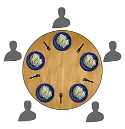

# The Dining Philosophers Problem

This is a classic synchronization problem in computer science. The problem is based on a scenario where   
five philosophers sit at a round table, each with a bowl of spaghetti. There are five forks placed   
between each pair of adjacent philosophers. Each philosopher alternates between thinking and eating.   
When a philosopher is eating, they need to use two forks – one on either side of their bowl. However,   
there are only five forks available, so at any given time, only four philosophers can eat. The challenge   
is to design a solution that allows the philosophers to eat without any of them getting stuck in an   
infinite wait for a fork.  
    
[Wikipedia](https://en.wikipedia.org/wiki/Dining_philosophers_problem)

- A classic synchronization problem introduced by Diijkstra in 1965.
- Five philosophers live in a house together, and always dine together at the same table sitting in the same place.
- They always eat a special kind of spaghetti which requires two forks.
- There are two forks next to each plate, which means that no two neighbors can be eating at the same time.

How do you write a program that ensures that **no philosopher** will **starve**?

